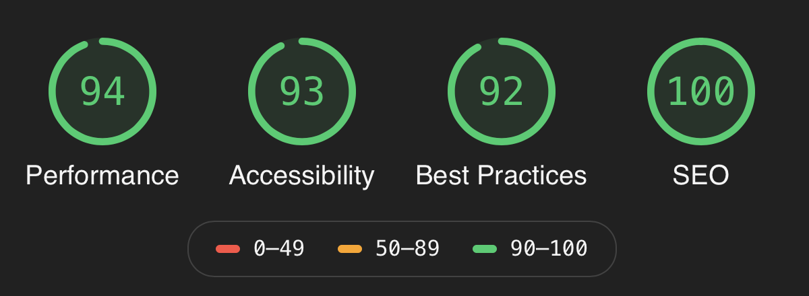

<h1 align="center">Personal website & blog 📖⚡️</h1>
<p>
  
  <a href=“./LICENSE” target="_blank">
    
  </a>


</p>

> _Code for my custom themed Gatsby blog made with Gatsby + TailwindCSS + Contentful_

### 🏠 [Give it a look here](https://www.nicolasracchi.com)

#### Hey! I’ve written a [quick article](https://www.nicolasracchi.com/blog/gatsby-netlify) about the process of building this blog… on this blog.

## Install & Develop

```sh
# clone this repo
git clone https://github.com/nicolas-racchi/personal-website.git

# cd into project
cd personal-website

# install dependencies and run development version
npm install && npm run dev
```

## Main Dependencies & Tools

- [Gatsby](https://www.gatsbyjs.org) - Awesome and ultra-fast static site generator built on React
- [React burger menu](https://github.com/negomi/react-burger-menu) - Reponsive menu for mobile devices
- [Gatsby-source-Contentful](https://www.gatsbyjs.org/packages/gatsby-source-contentful/?=conten) - Really convenient way of managing and publishing articles.
- [TailwindCSS](https://tailwindcss.com) - Really easy and fast CSS framework, 100% customizable.

## Cool Features

- Code block highlighting with [react-code-blocks](https://github.com/rajinwonderland/react-code-blocks)
- Blog scrollbar indicator
- Canonical URLs
- Disqus Comments
- Simple page animations
- Light & Dark mode with custom theme switch

## Environment variables

You can find all required env variables in the `.env.sample` file.

_Note: the only required variables are `CONTENTFUL_SPACE_ID` and `CONTENTFUL_ACCESS_TOKEN` which are needed for rendering blog posts. You can leave other variables blank to get some warnings._

## Connect your own Contentful ID

The connection with Contentful requires a bit of know-how. This is because the actual name of your contentful collections is going to be different from mine, depending on how you create your Contentful content models. If you need help, I recommend following this [tutorial](https://medium.com/codingthesmartway-com-blog/gatsby-and-contentful-the-headless-cms-approach-5c7137145ace).
Don't hesitate contacting me if you need anything else.

## Lighthouse performance



## Author

👤 **Nicolas Racchi**

- Github: [@nicolas-racchi](https://github.com/nicolas-racchi)
- LinkedIn: [@nicolas-racchi](https://linkedin.com/in/nicolas-racchi)

## Show your support

Give a ⭐️ if this project helped you!

---

## License & Usage

You are free to use this as a template for your own personal website or blog.

Copyright © 2019 Nicolas Racchi - MIT License
